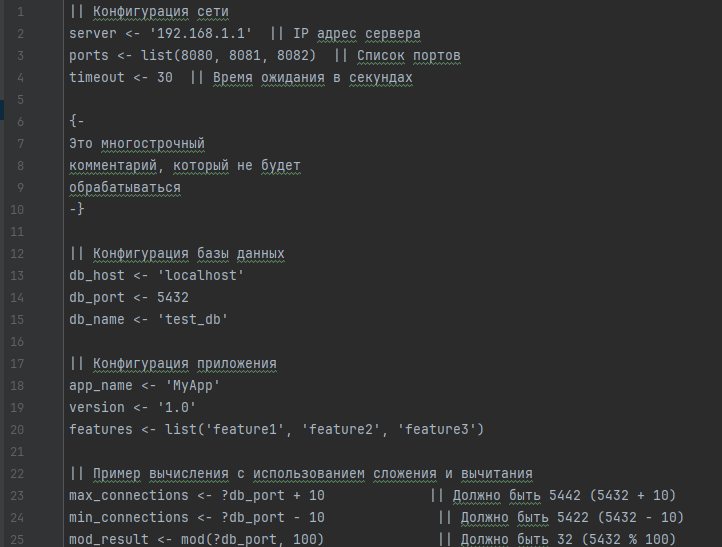
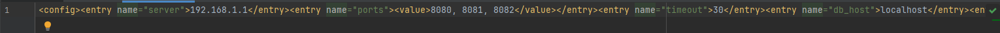
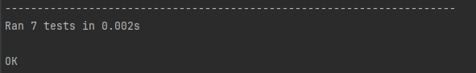

# Домашнее задания №3

## Задание
Разработать инструмент командной строки для учебного конфигурационного
языка, синтаксис которого приведен далее. Этот инструмент преобразует текст из
входного формата в выходной. Синтаксические ошибки выявляются с выдачей
сообщений.
Входной текст на учебном конфигурационном языке принимается из
файла, путь к которому задан ключом командной строки. Выходной текст на
языке xml попадает в файл, путь к которому задан ключом командной строки.

Однострочные комментарии:
|| Это однострочный комментарий

Многострочные комментарии:

{-

Это многострочный
комментарий

-}

Массивы:
list( значение, значение, значение, ... )
Имена:
[a-zA-Z]+

Значения:
- Числа.
- Строки.
- Массивы.

Строки:
'Это строка'

Объявление константы на этапе трансляции:
имя <- значение

Вычисление константного выражения на этапе трансляции (постфиксная
форма), пример:
?[имя 1 +]
Результатом вычисления константного выражения является значение.

Для константных вычислений определены операции и функции:
1. Сложение.
2. Вычитание.
3. mod().

Все конструкции учебного конфигурационного языка (с учетом их
возможной вложенности) должны быть покрыты тестами. Необходимо показать 3
примера описания конфигураций из разных предметных областей.


### Запуск программы

Для запуска необходимо ввести команду:

```
python main.py --input <имя входного файла .txt> --output <имя выходного файла .xml>
```

### Запуск тестов

```
python -m unittest tests.py
```

В ходе работы:
1. Был разработан парсер учебного языка:




2. Написаны тесты, которые успешно выполняются:

